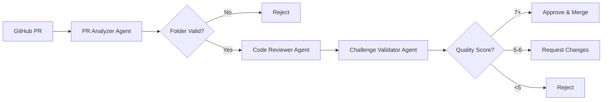

# 🤖 PR Review Bot

An intelligent, AI-powered automated PR review system for the **30 Days of Solidity** challenge. This bot uses multi-agent AI (powered by Google Gemini via CrewAI) to review Solidity code submissions, validate them against challenge requirements, and automatically approve or request changes.

[](https://www.python.org/downloads/)
[](https://github.com/joaomdmoura/crewAI)
[](LICENSE)

---

## ✨ Features

- 🤖 **Multi-Agent AI System** - 3 specialized AI agents for comprehensive code review
- 🎯 **Intelligent Day Detection** - 5 different methods to detect which challenge day
- 💰 **Token Optimization** - Reduces API costs by 20-40% through code optimization
- 📦 **Batch Processing** - Review multiple PRs with configurable rate limiting
- 🎓 **Beginner-Friendly** - Encouraging feedback with low approval thresholds
- 🔄 **Auto-Merge** - Automatically merges approved PRs
- 📊 **Detailed Logging** - Track token usage, approval rates, and performance

---

## 🏗️ Architecture



### AI Agents

| Agent | Purpose | Responsibility |
|-------|---------|----------------|
| **PR Analyzer** | Structure Analysis | Detects challenge day, validates folder structure, optimizes code |
| **Code Reviewer** | Quality Check | Reviews Solidity code for compilation, functionality, and quality |
| **Challenge Validator** | Requirement Validation | Checks if submission meets day-specific requirements |

---

## 🚀 Quick Start

### Prerequisites

- Python 3.9 or higher
- GitHub Personal Access Token
- Google Gemini API Key

### Installation

1. **Clone the repository**
   ```bash
   git clone https://github.com/yourusername/pr-review-bot.git
   cd pr-review-bot
   ```

2. **Run the installation script**
   ```bash
   chmod +x install.sh
   ./install.sh
   ```

   Or manually:
   ```bash
   python3 -m venv venv
   source venv/bin/activate
   pip install -r requirements.txt
   ```

3. **Configure environment variables**
   ```bash
   cp .env.example .env
   nano .env
   ```

   Add your credentials:
   ```env
   GITHUB_TOKEN=your_github_token_here
   GOOGLE_API_KEY=your_google_api_key_here
   GITHUB_REPO=owner/repo-name
   ```

4. **Test the setup**
   ```bash
   python3 test_setup.py
   ```

---

## 📖 Usage

### Review a Single PR

```bash
python3 main.py --pr 123
```

### Review Multiple PRs (Batch Mode)

```bash
python3 main.py --pr 123 124 125
```

### Dry Run (No GitHub Posting)

```bash
python3 main.py --pr 123 --dry-run
```

### Using PR URLs

```bash
python3 main.py --pr https://github.com/owner/repo/pull/123
```

### Custom Configuration

```bash
python3 main.py --pr 123 --config custom_config.yaml
```

---

## ⚙️ Configuration

Edit `config.yaml` to customize the bot's behavior:

### Key Settings

```yaml
# Review mode
mode: "beginner_friendly"

# Batch processing delays (seconds)
delays:
  between_prs: 25      # Wait between different PRs
  between_files: 10    # Wait between files within a PR

# Quality thresholds
scoring:
  thresholds:
    approve: 4.0       # Low threshold for beginners
    reject: 1.0

# Validation rules
validation:
  concept_coverage: 0.50           # Only 50% coverage needed
  allow_simplified: true
  allow_learning_from_solutions: true

# Feedback settings
feedback:
  tone: "encouraging"
  always_praise_first: true
  max_length: 3000

# LLM configuration
llm:
  provider: "google"
  model: "gemini-2.5-flash"
  temperature: 0.7
  max_tokens: 2048
```

---

## 📊 How It Works

### Review Workflow

1. **Fetch PR Data** - Retrieves PR metadata and Solidity files from GitHub
2. **Analyze Structure** - Validates folder structure and detects challenge day
3. **Optimize Code** - Removes comments/whitespace to reduce token usage
4. **Review Files** - Each file is reviewed individually for quality
5. **Validate Challenge** - Checks if submission meets day-specific requirements
6. **Make Decision** - Determines APPROVE, REQUEST_CHANGES, or REJECT
7. **Post Review** - Submits review to GitHub with labels
8. **Auto-Merge** - Merges approved PRs automatically

### Decision Logic

| Quality Score | Action | Labels | Auto-Merge |
|---------------|--------|--------|------------|
| 7-10 | APPROVE | `day-X`, `approved` | ✅ Yes |
| 5-6 | REQUEST_CHANGES | `day-X`, `needs-fix` | ❌ No |
| 0-4 | REJECT | `day-X`, `rejected` | ❌ No |

### Folder Structure Validation

Files must be in: `submissions/<subfolder>/`

❌ **Invalid:** `submissions/MyContract.sol`  
✅ **Valid:** `submissions/john-doe/MyContract.sol`

---

## 🎯 Challenge Day Detection

The bot uses 5 detection methods with confidence-based fallback:

1. **PR Title/Description** (95% confidence) - Patterns like "day 1", "challenge 1"
2. **Folder Path** (90% confidence) - Patterns like `/day-1/`, `/day1/`
3. **Contract Name Exact Match** (95% confidence) - Matches `challenges.json`
4. **Filename Pattern** (70% confidence) - Patterns like `day1.sol`, `1-counter.sol`
5. **Contract Name Fuzzy Match** (60-85% confidence) - Fuzzy string matching

---

## 💰 Token Optimization

The bot optimizes code before sending to the AI to reduce costs:

### Optimization Steps
1. Remove SPDX license identifiers
2. Remove single-line comments (`//`)
3. Remove multi-line comments (`/* */`)
4. Remove NatSpec comments (`///`)
5. Remove extra blank lines
6. Strip leading/trailing whitespace

### Typical Savings
- **Average:** 20-40% token reduction
- **Example:** 1,000 tokens → 600-800 tokens
- **Cost Impact:** Significant savings on large batches

---

## 📁 Project Structure

```
pr-review-bot/
├── main.py                    # Main entry point
├── config.yaml                # Configuration settings
├── challenges.json            # 30 days challenge definitions
├── get_prs.py                 # Utility to fetch PRs by date
├── requirements.txt           # Python dependencies
├── install.sh                 # Installation script
├── test_setup.py              # Setup testing script
├── .env.example               # Environment template
├── .gitignore                 # Git ignore patterns
├── agents/
│   ├── pr_analyzer.py         # PR structure analysis
│   ├── code_reviewer.py       # Code quality review
│   ├── challenge_validator.py # Challenge validation
│   └── single_file_reviewer.py# Single file review tasks
└── utils/
    ├── github_client.py       # GitHub API wrapper
    ├── file_detector.py       # Challenge day detection
    └── token_optimizer.py     # Code optimization
```

---

## 🛠️ Advanced Usage

### Fetch PRs by Date Range

Use `get_prs.py` to get PR numbers from a specific date range:

```bash
python3 get_prs.py
```

This generates:
- `pr_numbers_june_july_2025.txt` - List of PR numbers
- `pr_details_june_july_2025.txt` - Detailed PR information

Then review them in batch:
```bash
python3 main.py --pr $(cat pr_numbers_june_july_2025.txt | tr '\n' ' ')
```

### Custom Challenge Definitions

Edit `challenges.json` to add or modify challenges:

```json
{
  "day": 1,
  "contractName": "ClickCounter.sol",
  "conceptsTaught": [
    "Basic Solidity syntax",
    "Variables (uint)",
    "Increment/Decrement functions"
  ],
  "exampleApplication": "...",
  "youtubeLink": "...",
  "solutionLink": "..."
}
```

---

## 📈 Performance

### Typical Review Times

- **Single PR:** 10-20 seconds
- **Batch (10 PRs):** 5-7 minutes (with delays)
- **Token Usage:** 2,500-4,000 tokens per PR

### Rate Limiting

Configurable delays prevent GitHub API rate limits:
- **Between PRs:** 25 seconds (default)
- **Between Files:** 10 seconds (default)

---

## 🔒 Security

### Environment Variables

All sensitive data is stored in `.env`:
- `GITHUB_TOKEN` - GitHub Personal Access Token
- `GOOGLE_API_KEY` - Google Gemini API Key
- `GITHUB_REPO` - Target repository

### Permissions Required

**GitHub Token Scopes:**
- `repo` - Full repository access
- `pull_request` - PR read/write
- `workflow` - Workflow access (if using Actions)

---

## 🧪 Testing

### Run Setup Tests

```bash
python3 test_setup.py
```

This verifies:
- ✅ Environment variables are set
- ✅ Required files exist
- ✅ Python packages are installed
- ✅ Token optimizer works
- ✅ File detector works

### Manual Testing

```bash
# Test with dry run (no GitHub posting)
python3 main.py --pr 123 --dry-run

# Check output for errors
# Verify decision logic
# Review generated feedback
```

---

## 🐛 Troubleshooting

### Common Issues

**Issue:** `GITHUB_TOKEN not found`
```bash
# Solution: Check .env file
cat .env
# Ensure GITHUB_TOKEN is set
```

**Issue:** `ModuleNotFoundError: No module named 'crewai'`
```bash
# Solution: Install dependencies
pip install -r requirements.txt
```

**Issue:** `Rate limit exceeded`
```bash
# Solution: Increase delays in config.yaml
delays:
  between_prs: 30  # Increase from 25
  between_files: 15  # Increase from 10
```

**Issue:** `Could not detect day`
```bash
# Solution: Check PR title/description includes day number
# Or ensure folder structure includes day indicator
# Example: submissions/john/day-1/
```

---

## 📝 Example Output

```
============================================================
REVIEWING PR #123
============================================================

📥 Fetching PR data...
✅ PR fetched: Day 1 - Click Counter
   Author: john_doe
   Files: 1 Solidity file(s)

🤖 Initializing AI agents...

🔍 Analyzing PR structure...
✅ Detected: Day 1
   Challenge: ClickCounter.sol
   Token savings: 35.2%

📄 Reviewing file 1/1: ClickCounter.sol
   Quality score: 8/10
   ✅ Looks good

🎯 Validating challenge requirements...

⚖️  Making final decision...
   ✅ APPROVE - All files look good!

============================================================
📊 REVIEW RESULTS
============================================================

Good job! Your code looks solid.

============================================================
Decision: APPROVE
Labels: day-1, approved
============================================================

📤 Posting review to GitHub...
✅ Review posted successfully!

🔀 Auto-merging PR...
✅ PR merged successfully!

============================================================
✨ REVIEW COMPLETE
============================================================
PR #123: APPROVE
Token savings: 245 tokens
Percentage saved: 35.2%
============================================================
```

---

## 🤝 Contributing

Contributions are welcome! Please:

1. Fork the repository
2. Create a feature branch (`git checkout -b feature/amazing-feature`)
3. Commit your changes (`git commit -m 'Add amazing feature'`)
4. Push to the branch (`git push origin feature/amazing-feature`)
5. Open a Pull Request

---

## 📄 License

This project is licensed under the MIT License - see the [LICENSE](LICENSE) file for details.

---

## 🙏 Acknowledgments

- **CrewAI** - Multi-agent orchestration framework
- **Google Gemini** - AI language model
- **PyGithub** - GitHub API wrapper
- **30 Days of Solidity** - Challenge program

---


## 🗺️ Roadmap

### Planned Features

- [ ] Actual Solidity compilation validation
- [ ] Structured output parsing (replace regex)
- [ ] Retry logic for API failures
- [ ] Webhook support for automatic reviews
- [ ] Dashboard for metrics tracking
- [ ] Multi-language support
- [ ] Custom feedback templates
- [ ] Integration with CI/CD pipelines

---

## 📊 Stats

- **Lines of Code:** ~850
- **AI Agents:** 3
- **Detection Methods:** 5
- **Token Savings:** 20-40%
- **Review Time:** 10-20s per PR

---

**Made with ❤️ for the Web3 developer community**
